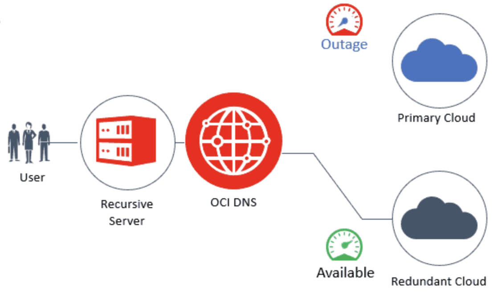
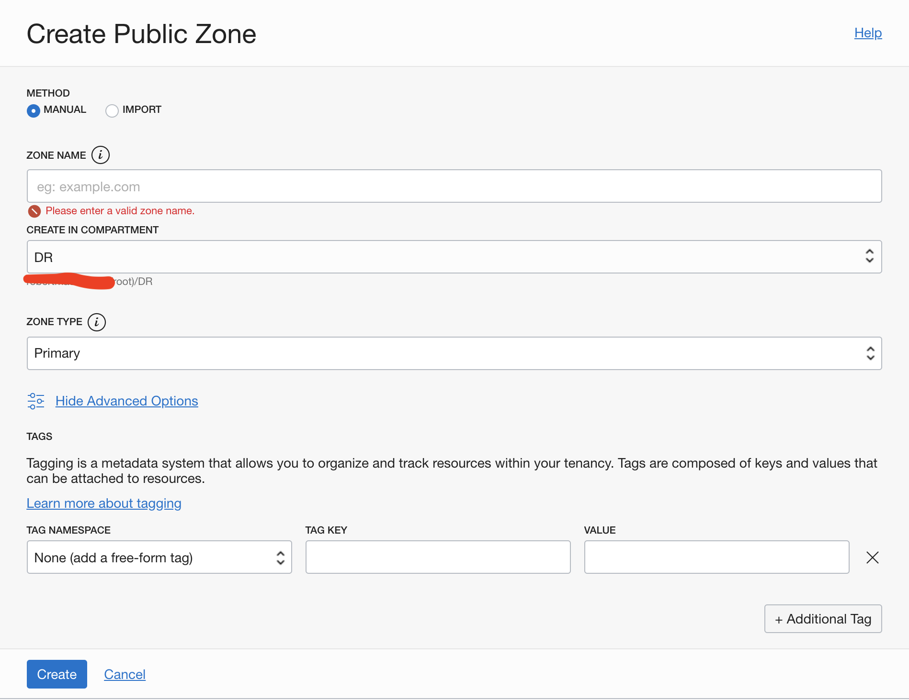
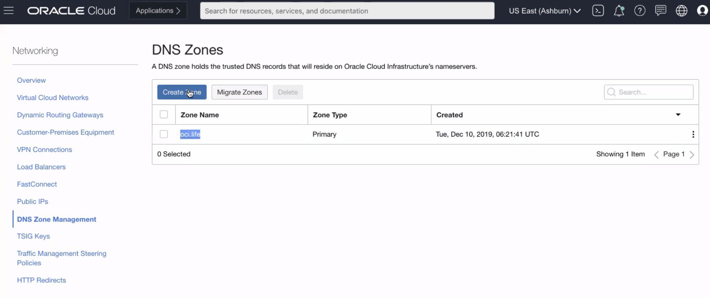
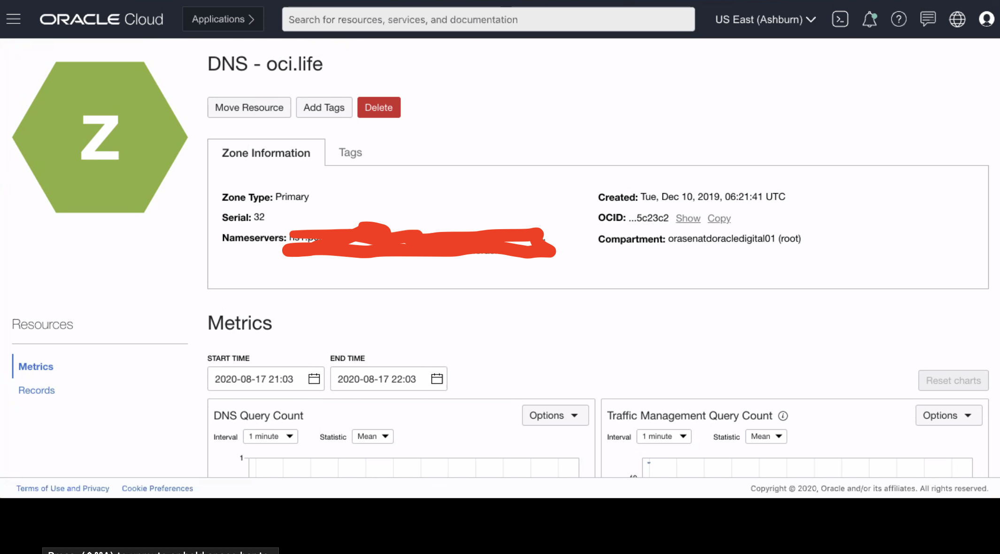
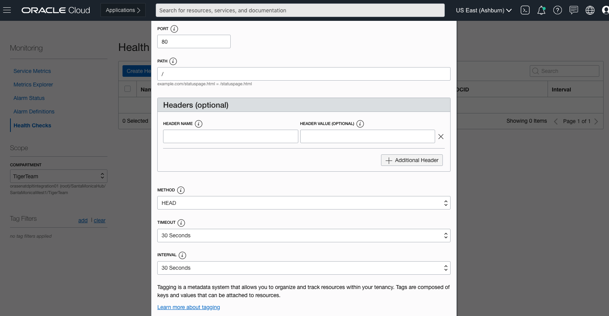

# Setup your Environment

## Introduction



Disaster Recovery Network and connectivity setup
=======================================================

This solution provides a Network Architecture deployment to demonstrate Disaster Recovery scenario across 2 regions [examples are geared towards region London & Frankfurt, but any regions in OCI can be used].

Note: This is **not** configured for a product environment. **This is just for demo purposes.**

Estimated lab time: 1 hour

### Objectives
- Use attached Terraform scripts to provision the environment
- Complete standby region load balancer setup in OCI console
- Configure DNS for primary region

## Quickstart Deployment
### Prerequisites
1. An Oracle Paid or LiveLabs account
2. [Download ZIP](https://objectstorage.us-ashburn-1.oraclecloud.com/p/wWYoFrZW-yxWOlp7ZDMc20-ugQ-gA5vo0EEXckfDvwY1015KkDd4WglW3ta6pmjp/n/c4u03/b/data-management-library-files/o/resource-manager-bin-dr.zip)
3.  Create your own private/public key pair on your local system.
4.  Move the key pair to the resource-manager-bin folder.
5.  Zip up all of the files from resource-manager-bin folder. The zip file name is not important.
    Just make sure it has the following file structure.
    
        resource-manager-bin/
        ├── assets
        │   ├── images
        │   │   └── oracle.png
        │   ├── scripts
        │   │   ├── block-volume-migration.py
        │   │   ├── boot-volume-migration.py
        │   │   ├── cloud_init_checker.sh
        │   │   └── README.md
        │   └── templates
        │       ├── bootstrap_dst.tpl
        │       └── bootstrap_src.tpl
        ├── data_sources.tf
        ├── dr_schema.yaml
        ├── id_rsa
        ├── id_rsa.pub
        ├── main.tf
        ├── modules
        │   ├── bastion_instance
        │   │   ├── main.tf
        │   │   ├── outputs.tf
        │   │   └── variables.tf
        │   ├── dbaas
        │   │   ├── main.tf
        │   │   └── variables.tf
        │   ├── iam
        │   │   ├── main.tf
        │   │   ├── outputs.tf
        │   │   └── variables.tf
        │   ├── lb
        │   │   ├── main.tf
        │   │   ├── outputs.tf
        │   │   └── variables.tf
        │   ├── network
        │   │   ├── main.tf
        │   │   ├── outputs.tf
        │   │   └── variables.tf
        │   ├── object_storage
        │   │   ├── main.tf
        │   │   ├── outputs.tf
        │   │   └── variables.tf
        │   ├── rsync
        │   │   ├── main.tf
        │   │   ├── outputs.tf
        │   │   └── variables.tf
        │   ├── server
        │   │   ├── main.tf
        │   │   ├── outputs.tf
        │   │   └── variables.tf
        │   └── shared_fss
        │       ├── main.tf
        │       ├── outputs.tf
        │       └── variables.tf
        ├── outputs.tf
        ├── providers.tf
        ├── README.md
        ├── terraform.tfvars
        └── variables.tf
    
## **Step 1:** Resource Manager

The following section will show you how to configure resource manager to make the deployment easier. Anything that is 
shaded out on the page. You will not be able to configure.

### Configuration 

1.  Navigate to the resource manager tab in oci. Next upload the zip file to the stack.
    
    
2.  Input the configuration for the instances.
    

3.  Input the configuration for the vcn
    
    
4.  Input the configuration for the load balancer and database
    
    
5.  Input the configuration for the object storage.
    
    
6.  Input the configuration for the keys. Since the keys are in the zip file. Make sure to put
    "./" in front of the keys names.
    
    
    ### Review process
    
    
    ### Plan


1.  Select plan from the dropdown menu.
    
    
2.  Make sure everything looks okay and then proceed
    

3.  Wait until the icon turns green.
    
    
    ### Apply
    
1.  Select apply from the dropdown menu. 
    
    
2.  Wait until the icon turns green.
    


### Destroy
 If you want to delete the infrastructure.
    First navigate to OCI Console and terminate the Standby database and once the termination is successful then resource manager can be used to destroy the environment.
1.  Select destroy from the dropdown menu. 
    

2.  Wait until the icon turns green.
    

### Inputs
*The following inputs are required for terraform modules:*

    ```
    Argument
    Description

    dr_region
    standby region in which to operate, example: us-ashburn-1, us-phoenix-1, ap-seoul-1, ap-tokyo-1, ca-toronto-1>

    dr_vcn_cidr_block
    CIDR block of the VCN (Virtual Cloud Network) to be created in standby region. make sure the VCN CIDR blocks of primary and standby regions do not overlap

    vcn_cidr_block
    CIDR block of the VCN (Virtual Cloud Network) to be created in primary region. make sure the VCN CIDR blocks of primary and standby regions do not overlap

    vcn_dns_label
    DNS Label of the VCN (Virtual Cloud Network) to be created.

    bucket_display_name
    Display name of the object storage bucket, this name will be prefixed with region name to keep unique name across regions

    bastion_server_shape
    This is compute shape for bastion server. For more information on available shapes, see VM Shapes

    app_server_shape
    This is compute shape for application servers deployed in primary region for hosting application. For more information on available shapes, see VM Shapes

    db_display_name
    The user-provided name of the Database Home

    db_system_shape
    The shape of the DB system. The shape determines resources allocated to the DB system.For virtual machine shapes, the number of CPU cores and memory and for    bare metal and Exadata shapes, the number of CPU cores, memory, and storage. To get a list of shapes, use the ListDbSystemShapes operation.

    db_admin_password
    A strong password for SYS, SYSTEM, PDB Admin and TDE Wallet. The password must be at least nine characters and contain at least two uppercase, two lowercase,   two numbers, and two special characters. The special characters must be _, #, or -.

    lb_shape
    A template that determines the total pre-provisioned bandwidth (ingress plus egress). To get a list of available shapes, use the ListShapes operation. Example: 100Mbps

    cron_schedule
    Cron schedule of backup/restore of boot/block volumes in Primary region. Example: "0 */12 * * *" this runs every 12 hours. This cron job runs on the bastion server

    dr_cron_schedule
    Cron schedule of backup/restore of boot/block volumes in Standby region. Example: ""#0 */12 * * *"" this is commented out intentionally as the region is in standby mode. When switchover to this region happens then this should be uncommented

    snapshot_frequency
    Cron schedule for taking snapshots of file storage system in Primary region, this is taken on primary_app_server_1. Example "@hourly" for taking hourly snapshots

    data_sync_frequency
    Cron schedule for synchronizing the file storage system between both standby and primary region. The rsync job is run as part of this cron scheduler on the compute "dr_replication_server" in standby region. Example "*/30 * * * *" this runs every 30 minutes
    ```
### Example of the results terraform will produce.
 1. *Example: Instances in the Primary Region*

    
 
 2. *Example: Database system in the Primary Region*

    
 
 3. *Example: Instance in the Secondary Region*

    
 
 4. *Example: Database system in the Secondary Region*

    
 
## **Step 2:** Create the DNS zone.

### Create a new DNS zone
1.
    
2.
    
3.
    

## **Step 3:** Adding Html to the compute instances.

You can place these HTML files in your app-tier compute nodes to demonstrate the DR working by displaying different HTML pages depending on which region you are hitting. You can see this information in the IP address as well, but this is additional visual stimulation.

### Primary Instance
*Follow the instructions here*
    ```
    # Replace the text in index.html with the text from PRIMARY.html.
    # sudo vi /var/www/html/index.html

    # Replace the text in index.html with the text from PRIMARY.html.
    # sudo vi /var/www/html/index.html

    # Replace the text in index.html with the text from STANDBY.html.
    # sudo vi /var/www/html/index.html

    # After you have updated the index.html on there respected instances.
    # run the following command.
    # sudo systemctl restart httpd

    ```

### Create a Health Check
1.

2.

3.

4.

You may now **proceed to the next lab**.

## Acknowledgements
- **Last Updated by/Date** - Alex MacDonald, October 2020

## See an issue?

Please submit feedback or ask for help using our [LiveLabs Support Forum](https://community.oracle.com/tech/developers/categories/livelabsdiscussions). Please click the Log In button and login using your Oracle Account. Click the Ask A Question button to the left to start a New Discussion or Ask a Question. Please include your workshop name and lab name. You can also include screenshots and attach files. Engage directly with the author of the workshop.

