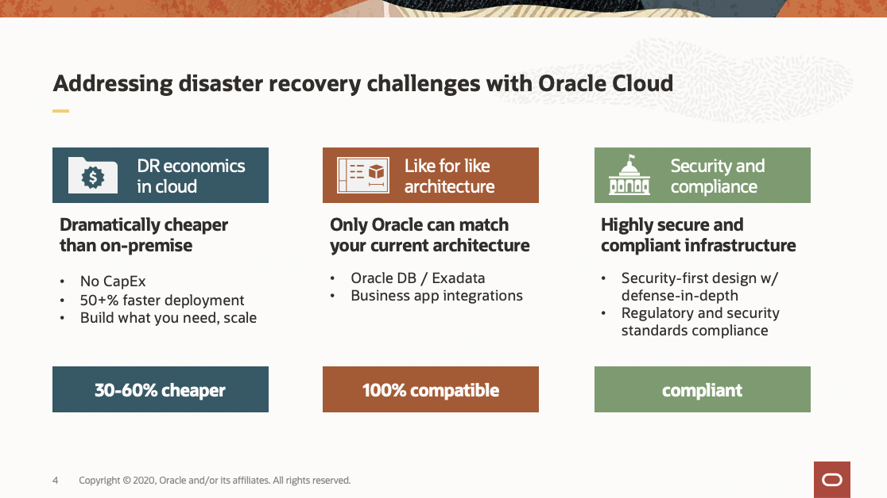
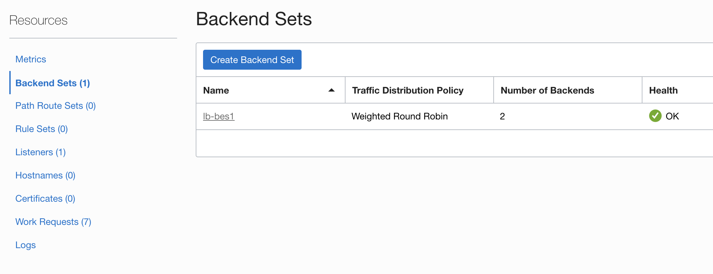
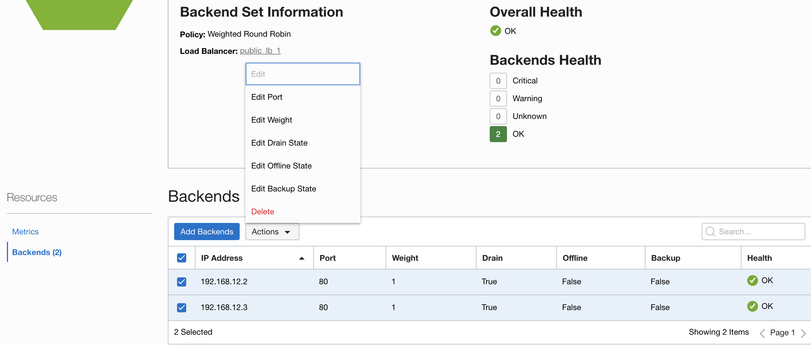
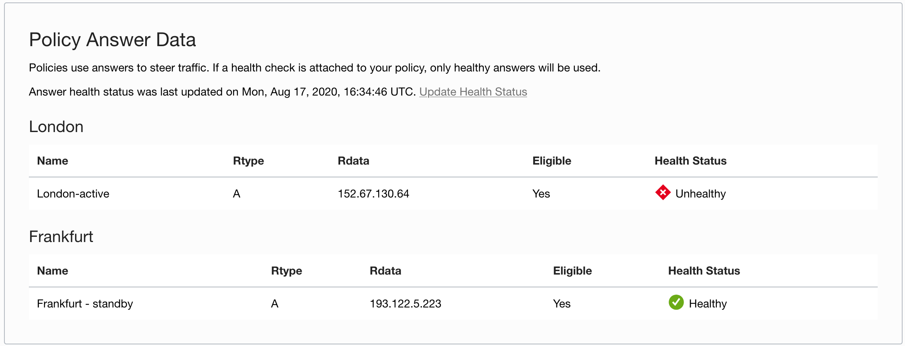
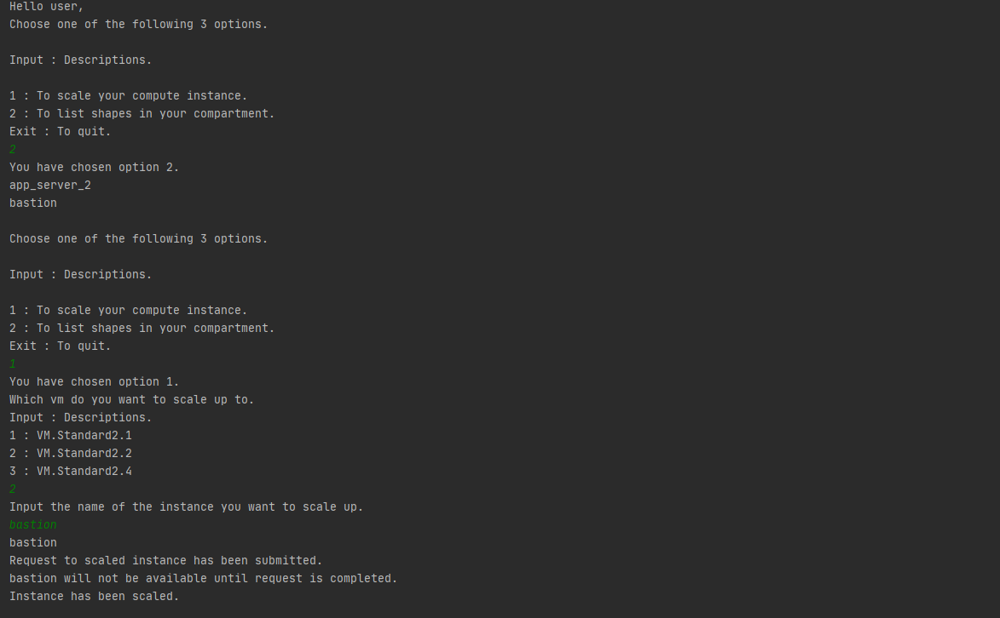

# Simulate Disaster
<!-- Comment out table of contents
## Table of Contents
[Introduction](#introduction)
-->

## Introduction

In this lab you will simulate the disaster and failover to your standby infrastructure that you configured in the previous labs. First the DNS will failover to your DR region and you will use the Python SDK to scale your compute in the DR region to handle the increased traffic. 

Estimated lab time: 1 hour

### Objectives
- Drain connections in Primary load balancer
- Perform DNS failover to DR region
- Scale up compute node in DR region

## **STEP 1:** The Disaster

### Drain connections from Primary Region Load Balancer

1. Navigate from the upper left hamburger menu to networking -> Load balancers. Find the Load Balancer in your primary region.

  

2. Go to your backend set. 

  

3. Check mark your backends. Then press actions.

  

4. Set the drain state to True. This will stop all current connections and simulate the disaster. 

  

5. Your health check on your primary region is now failing, and traffic hitting your DNS should now be routed to your DR region. 
  

6. If you installed the HTML to your DR server, you should now see this. You can see our DNS entry - 'oci.life' with the subdomain 'alexmcdonald'.
  

7. If you navigate to health/check traffic steering - you can see the health for the Primary region load balancer is now critical. If you visit the IP address of this load balancer, you will get 502 bad gateway. 

8. Now, enter your DNS url in your web browswer, you should see the HTML indicating you are now seeing traffic steered to your standby region. 

## **STEP 2:** Scaling the standby region compute node

### Configure SDK

1. Please follow steps in [lab200](https://github.com/arshyasharifian/DR_DNS/blob/master/LabGuide200.md) to configure the SDK for your python scripts to call resources in your tenancy.

### Run Python scripts
1. [Download the python file](https://objectstorage.us-ashburn-1.oraclecloud.com/p/cT_e-91q3vOplvaxy4wCmuLrCjEQQAf6P6LlNYa_1PO2pz2Sncbgk6fdF5srgN98/n/c4u03/b/data-management-library-files/o/Labapi.py). Just copy the python files to your bastion instance. Then move your API key to the `.oci` folder. Then edit the config file with the correct configurations.

2. This [link](https://docs.cloud.oracle.com/en-us/iaas/Content/API/Concepts/apisigningkey.htm#Required_Keys_and_OCIDs) will help you setup the REST API key that python needs to run scaling script.

3. This [link](https://docs.cloud.oracle.com/en-us/iaas/Content/API/Concepts/sdkconfig.htm) example of a configuration file.

4. *The script will not continue unitl the scaling is complete. Check the OCI console work request to see when the instance will be available again.*
  

5. *The instance will be shutdown while the update takes place.*
  

6. *You can now log into the instance again*
  

## Summary

-   In this lab, you learned how to simulate a disaster event, and redirect traffic to your DR region. You have completed this workshop.

[Back to top](#introduction)

## Learn More
-   To learn more about Load Balancer, feel free to explore the capabilities by clicking on this link: [Load Balancer Documentation](https://docs.cloud.oracle.com/en-us/iaas/Content/Balance/Concepts/balanceoverview.htm)
-   To learn more about , how the OCI API scales up the compute node, here is the relevant [documentation](https://docs.cloud.oracle.com/en-us/iaas/api/#/en/iaas/20160918/datatypes/UpdateInstanceDetails).

## Acknowledgements
- **Last Updated by/Date** - Alex MacDonald, November 2020

## See an issue?

Please submit feedback or ask for help using our [LiveLabs Support Forum](https://community.oracle.com/tech/developers/categories/livelabsdiscussions). Please click the Log In button and login using your Oracle Account. Click the Ask A Question button to the left to start a New Discussion or Ask a Question. Please include your workshop name and lab name. You can also include screenshots and attach files. Engage directly with the author of the workshop.

